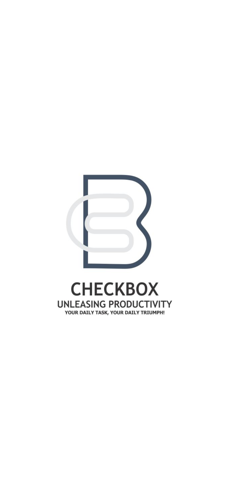

# Check-Box
> Welcome to CheckBox, the cutting-edge To-Do app designed to simplify your daily tasks and boost your productivity!

## Table of contents
* [General info](#general-info)
* [Screenshots](#screenshots)
* [Technologies](#technologies)
* [Dependencies] (#dependencies)
* [Setup](#setup)
* [Features](#features)
* [Status](#status)
* [Inspiration](#inspiration)
* [Contact](#contact)

## General info
This project was built using React.js and JavaScript as a way to not only help organise the user's schedule, but to also apply our knowledge of React Native, CRUD and general App building.
CheckBox provides a seamless and intuitive user experience for managing your to-do lists with efficiency and style.

## Screenshots


## Technologies
* React Native
* Expo SDK
* Javascript

## Dependencies
* async-storage
* react-navigation
* react-native-onboarding-swiper
etc

## Setup
* Clone the Repository:
```bash
git clone https://github.com/Kaych3e/Portfolio-Project-CheckBox
```

* Install Dependencies:
Run npm install to install the required dependencies and libraries.
```bash
npm install
```

* Start the App:
Use the command npm start to launch ReactDo locally on your machine.
```bash
npm start
```

* Explore and Contribute:
Dive into the codebase, explore the functionalities, and feel free to contribute by submitting issues or pull requests.

## Code Examples
Show examples of usage:
`put-your-code-here`

## Features
List of features ready and TODOs for future development
* Interactive User Interface:
Enjoy a modern and responsive user interface that adapts to different devices, making task management a breeze.
* Effortless Task Management:
Add, edit, and delete tasks with just a few clicks.

## The future of this To-do list:
* Customizable Themes:
Personalize your workspace with a variety of themes and color schemes to suit your preferences and create a visually pleasing environment.
* User Authentication:
Secure your to-do lists with user authentication, ensuring that your tasks are accessible only to you.
* Cross-Browser Compatibility:
Enjoy a consistent experience across different web browsers, ensuring accessibility for all users.
* Priority Levels:
Prioritize your tasks with ease. Mark tasks as high, medium, or low priority to focus on what matters most.

## Status
Project is: _in progress_

## Contact
* Nkechi Nnadi - nkaduba@gmail.com - @Kaych3e(github)
* Divine Lewis - divinitysoft0@gmail.com - Divinelewis(github)
